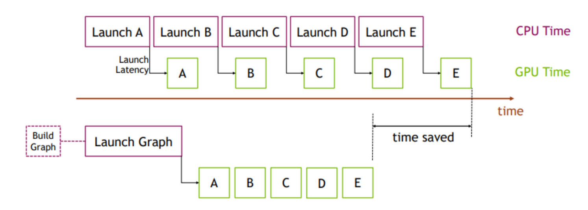

# CUDA Graph

## Introduction

When CPU request GPU to run a kernel, the GPU needs time to prepare the kernel. It will cost time. But if we could record the whole process of the kernel, and then replay the whole process, the GPU can skip the preparation time that at first between the multiple kernels.

So Cuda Graph is a feature of CUDA that allows you to record a sequence of CUDA operations and replay them later. It is useful for optimizing performance by avoiding the overhead of CPU launching time.

It could be shown in this figure:



## How to use

```bash
python main.py [cuda_graph, normal, all]
```

## Benchmark Results

- config:
  - batch_size: 20
  - hidden_size: 10
  - up_ratio: 4
  - forward_times: 100
- Hardware: GPU: RTX 3090, CPU: Intel(R) Xeon(R) Silver 4310 CPU @ 2.10GHz

| Method | Time |
|--------|------|
| Cuda Graph | 0.001268251333385706|
| Normal | 0.010649505071341991 |

## Reference

- [CUDA Graph Support](https://hebiao064.github.io/fa3-attn-backend-basic#0x3-cuda-graph-support)
